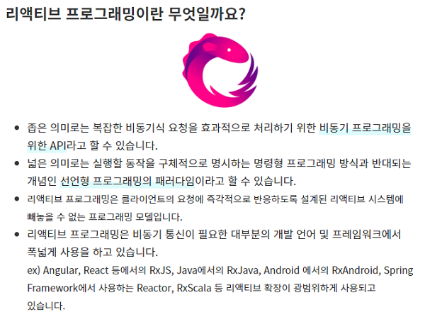
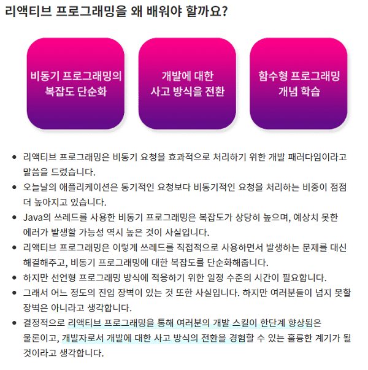

# 리액티브 프로그래밍, RxJava  

</img>
</img>

## 학습 목차

#### 1. [리액티브 프로그래밍 개요](https://www.notion.so/0641d07a7bd24a7a99d7960e515ca396)

해당 repo는 [Kevin의 알기 쉬운 RxJava 1부](https://www.inflearn.com/course/%EC%9E%90%EB%B0%94-%EB%A6%AC%EC%95%A1%ED%8B%B0%EB%B8%8C%ED%94%84%EB%A1%9C%EA%B7%B8%EB%9E%98%EB%B0%8D-1) 해당 강의를 듣고 정리한 REPO 입니다.
